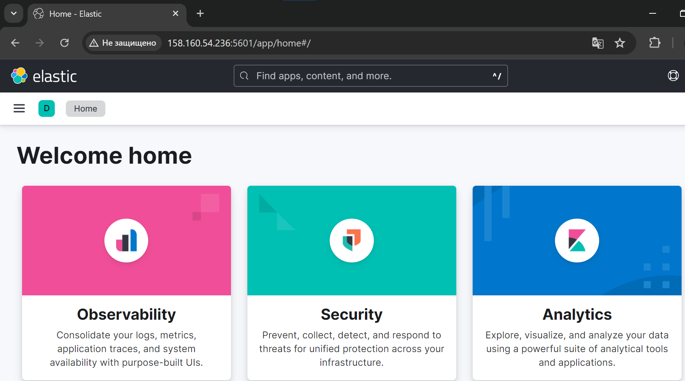
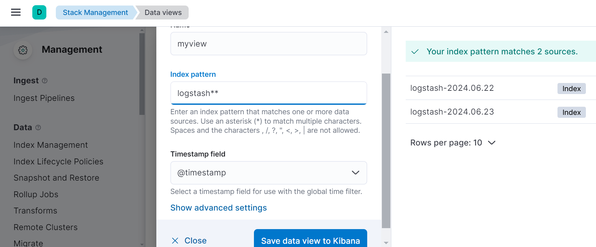
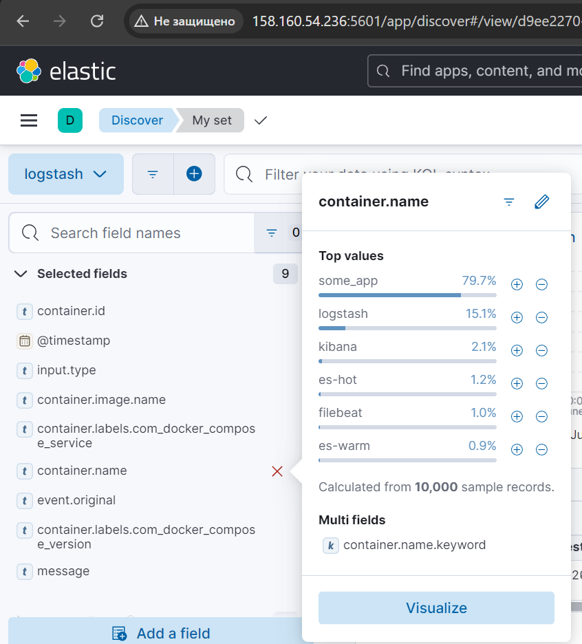

# Домашнее задание к занятию 15 «Система сбора логов Elastic Stack» - Илларионов Дмитрий

## Дополнительные ссылки

При выполнении задания используйте дополнительные ресурсы:

- [поднимаем elk в docker](https://www.elastic.co/guide/en/elastic-stack-get-started/current/get-started-docker.html);
- [поднимаем elk в docker с filebeat и docker-логами](https://www.sarulabs.com/post/5/2019-08-12/sending-docker-logs-to-elasticsearch-and-kibana-with-filebeat.html);
- [конфигурируем logstash](https://www.elastic.co/guide/en/logstash/current/configuration.html);
- [плагины filter для logstash](https://www.elastic.co/guide/en/logstash/current/filter-plugins.html);
- [конфигурируем filebeat](https://www.elastic.co/guide/en/beats/libbeat/5.3/config-file-format.html);
- [привязываем индексы из elastic в kibana](https://www.elastic.co/guide/en/kibana/current/index-patterns.html);
- [как просматривать логи в kibana](https://www.elastic.co/guide/en/kibana/current/discover.html);
- [решение ошибки increase vm.max_map_count elasticsearch](https://stackoverflow.com/questions/42889241/how-to-increase-vm-max-map-count).

В процессе выполнения в зависимости от системы могут также возникнуть не указанные здесь проблемы.

Используйте output stdout filebeat/kibana и api elasticsearch для изучения корня проблемы и её устранения.

## Задание повышенной сложности

Не используйте директорию [help](./help) при выполнении домашнего задания.

## Задание 1

Вам необходимо поднять в докере и связать между собой:

- elasticsearch (hot и warm ноды);
- logstash;
- kibana;
- filebeat.

Logstash следует сконфигурировать для приёма по tcp json-сообщений.

Filebeat следует сконфигурировать для отправки логов docker вашей системы в logstash.

В директории [help](./help) находится манифест docker-compose и конфигурации filebeat/logstash для быстрого 
выполнения этого задания.

Результатом выполнения задания должны быть:

_Поднял из кода из папки help_

- скриншот `docker ps` через 5 минут после старта всех контейнеров (их должно быть 5);

Сначала выполнил:

```
cat /etc/sysctl.conf | grep vm.max_map_count
```
пусто.

далее

```
sysctl -w vm.max_map_count=262144
```
и что бы и после перезагрузки:

```
echo "vm.max_map_count=262144" >> /etc/sysctl.conf
```
После запускаю контейнеры, иначе будут валиться с ошибкой.

```
docker compose up -d
```
После 5 мин:


- скриншот интерфейса kibana;



- docker-compose манифест (если вы не использовали директорию help);
- ваши yml-конфигурации для стека (если вы не использовали директорию help).


Еще проверяю что есть в эластике и что он работает:


Индексы в эластике:


## Задание 2

Перейдите в меню [создания index-patterns  в kibana](http://localhost:5601/app/management/kibana/indexPatterns/create) и создайте несколько index-patterns из имеющихся.




Перейдите в меню просмотра логов в kibana (Discover) и самостоятельно изучите, как отображаются логи и как производить поиск по логам.

Для начала зашел в одно из событий и посмотрел поля и какие значения есть и интересны ли они для анализа:


Выбрал те поля который интересны:


Пока так делал:
Захожу в мой сет:


Смотрю селектед поля:
и для них смотрю значения - набор.
Те которые интересны - нажимаю визуализацию:



Далее настраиваю визуализацию и сохраняю ее на дашборде.

В итоге получился мой дашбборд, в котором можно в онлайн режиме "проваливаться" в выбранные значения - фильтровать - сужать выборку и смотреть на дашборде распределение - результаты.


В манифесте директории help также приведенно dummy-приложение, которое генерирует рандомные события в stdout-контейнера.
Эти логи должны порождать индекс logstash-* в elasticsearch. Если этого индекса нет — воспользуйтесь советами и источниками из раздела «Дополнительные ссылки» этого задания.
 
---

### Как оформить решение задания

Выполненное домашнее задание пришлите в виде ссылки на .md-файл в вашем репозитории.

---

 
